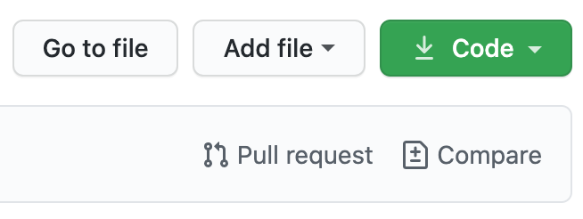

# GooGBooK - Google Book Search [](https://opensource.org/licenses/MIT)

## Table Of Contents

1. [License](#license)

2. [Description](#description)

3. [Installation](#installation)

4. [Usage](#usage)

5. [Contribution](#Contribution)

6. [Questions](#questions)

## Description

[Deployed app:https://googbook1.herokuapp.com/ ](https://googbook1.herokuapp.com/)

Technologies: Mongo Express React Node AtlasDB Heroku.

GoogBook is an application for those who enjoy to read, so it will be used any time the user wants to search for a new book and wants to keep the track of interesting books by saving them.

## Installation

To contribute to this project follow next steps:

1. Fork the repository.
   In the right corner of the page you should see a fork button. Press on it to fork the repository.

   

2. Copy the SSH link from the forked version of this app.

   

3. Clone the app locally. Insert in your CLI the command similar with the one bellow.

```bash
    git clone git@github.com:<your-git-hub-username>/goals-productivity-tracker.git
```

4. Install all libraries. Insert next command in your CLI:

```bash
npm install
```

5. To start the whole app insert in your CLI:

```bash
npm start
```

6. If you made some improvements in the app, you might want to upload your code, so one way to do this is to follow next steps:

```bash
git add -A
git commit -m "your commit text"
git push
```

7. Make a pull request. Go on your forked version of the app on GitHub, and look for pull request link; then, press on it and follow the steps:

/

8. Congratulation, you completed all steps to become part of the project.

Note:
-- To start just the back end side of your app insert in your CLI:

```bash
node server.js
```

-- To start just the front end part of the app, in your CLI enter in client folder; then insert:

```bash
npm start
```

-- Sometimes you might want to synchronize your local repository with the main branch. To do that follow next steps:

```bash
git remote -v
git remote add upstream <insert-here-ssh-link-from-the-main-branch>
git fetch upstream
git merge upstream/main main
git add .
git commit -m "<inset-here-the-comment-regarding-to-merging"
```

Following the steps above you will be able pull code and synchronize it locally.

If you have any questions, ask them on the email: paveldarii@yahoo.com.

## Usage


## Contribution

If you are interested to be part of the GOOGBOOK app, contact me on the email bellow. Thank You.

## Questions

My GitHub profile: [https://github.com/paveldarii](https://github.com/paveldarii).

My email address: paveldarii@yahoo.com

## License

[The MIT License](https://opensource.org/licenses/MIT/)
